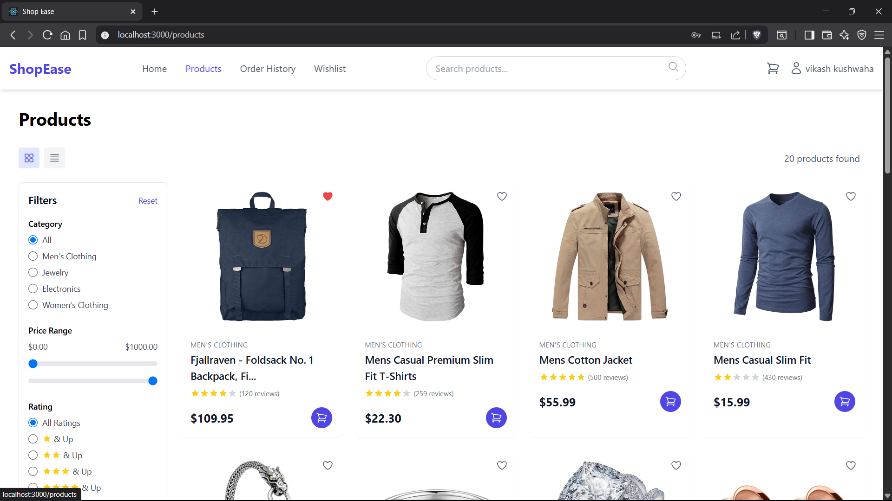
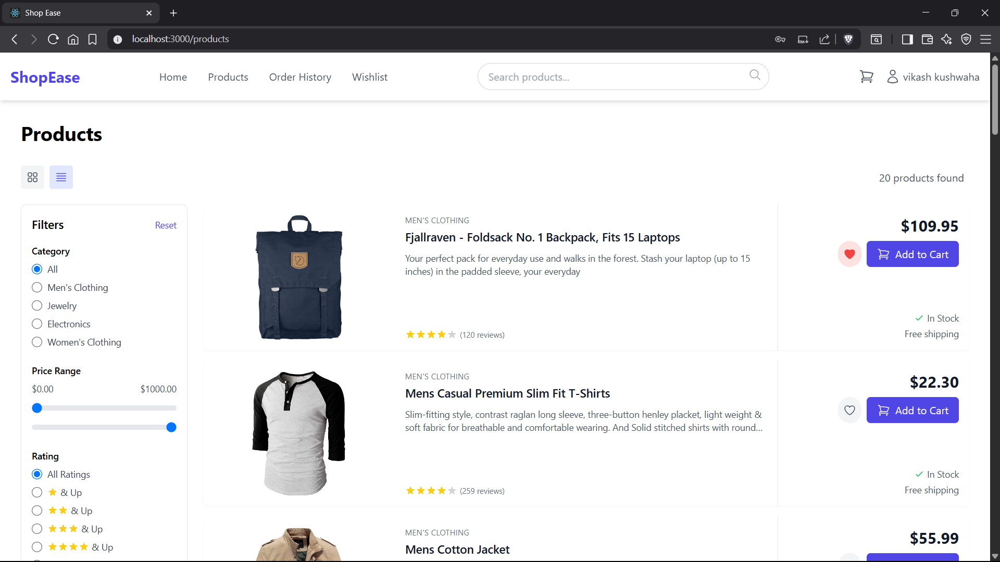
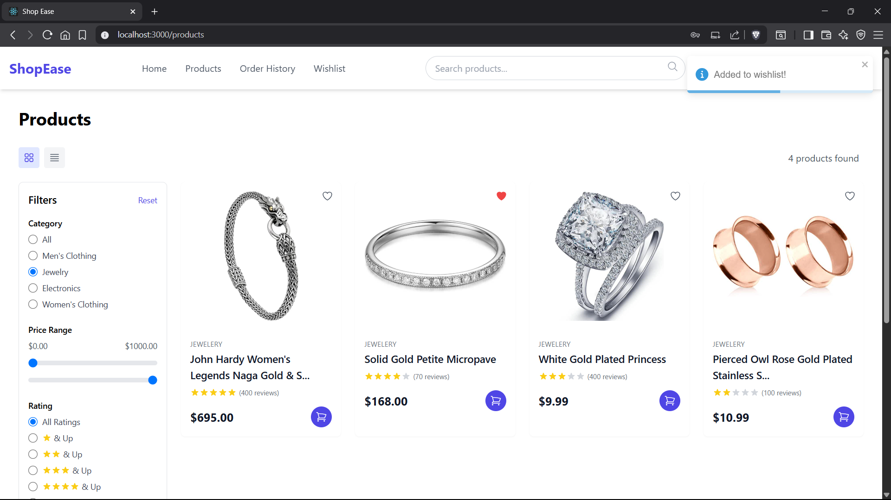

# E-commerce Store

A modern React-based e-commerce store with:
- Product listing, search, filters, grid/list view
- Cart management and checkout
- **User registration and login** (frontend-only, multi-user, localStorage)
- **User-specific order history** (localStorage)
- **Wishlist functionality** (add/remove/view wishlisted products)
- **Stripe payment integration** (test mode)

---

## Screenshots

### Homepage
|  |  |  |
|:---:|:---:|:---:|
| Main Banner | Featured Products | Categories Section |

### Authentication
|  |  |  |  |
|:---:|:---:|:---:|:---:|
| Login Page | Login Success | Register Page | Registration Success |

### Product Listing & Filters
|  |  |  |
|:---:|:---:|:---:|
| Search Results | All Filters | List View |
|  |  |  |
| Electronics Filter | Jewelry Filter | Men's Clothing Filter |
|  |  | |
| Women's Clothing Filter | Jewelry Added To Wishlist | |

### Wishlist
|  |  |
|:---:|:---:|
| My Wishlist Page | Wishlist Items Added To Cart |

### Cart & Checkout
|  |  |  |
|:---:|:---:|:---:|
| Cart Summary | Shipping Info | Payment Details |

### Profile & Order History
|  |  |  |
|:---:|:---:|:---:|
| Edit Profile | Profile Updated | Update Success Toast |
|  |  |
| Order History | No Orders |

### Others
|  |
|:---:|
| Newsletter Subscription Footer |

---

## Getting Started

### 1. Install dependencies
```bash
npm install
```

### 2. Set up environment variables
Create a `.env` file in your project root and add your Stripe publishable key:
```
REACT_APP_STRIPE_PUBLISHABLE_KEY=pk_test_51Rgpf8FZYKLOiBSmaZ8Iyixlh7y4yyaN9je9EjNiw4eCyNLMqBxuNURFTmIM1d68Q5bj1Y26n8qBQLkBtXJF7Bun000cLlwPAv
```

### 3. Start the frontend
```bash
npm start
```

### 4. Set up the backend for Stripe payments
See the section below for backend setup.

---

## Stripe Payment Backend Setup

To enable real payment processing with Stripe, a minimal backend is required to create PaymentIntents. This backend will be located in the `server/` directory.

### Steps:
1. Install backend dependencies:
   ```bash
   cd server
   npm install
   ```
2. Set your Stripe secret key in a `.env` file in the `server/` directory:
   ```env
   STRIPE_SECRET_KEY=sk_test_...
   ```
3. Start the backend server:
   ```bash
   npm start
   ```
4. The frontend will communicate with this backend for payment processing.

---

## Features
- **Product Listing:** Grid/List view, search, filters
- **Cart Management:** Add, remove, update quantity
- **Wishlist:** Add/remove/view wishlisted products
- **Checkout:** Shipping info, payment with Stripe
- **User Registration/Login:** Multi-user, localStorage only
- **User-Specific Order History:** Each user sees only their own orders
- **Responsive Design:** Works on desktop and mobile

---

## Notes
- This project is frontend-only for user management and order history (no real backend for users/orders).
- Stripe payments are in test mode. Use test cards from the [Stripe docs](https://stripe.com/docs/testing).
- For production, use your live Stripe keys and deploy the backend securely.

--

## Acknowledgments

This project was created as part of the Celebal Technologies React internship program.
